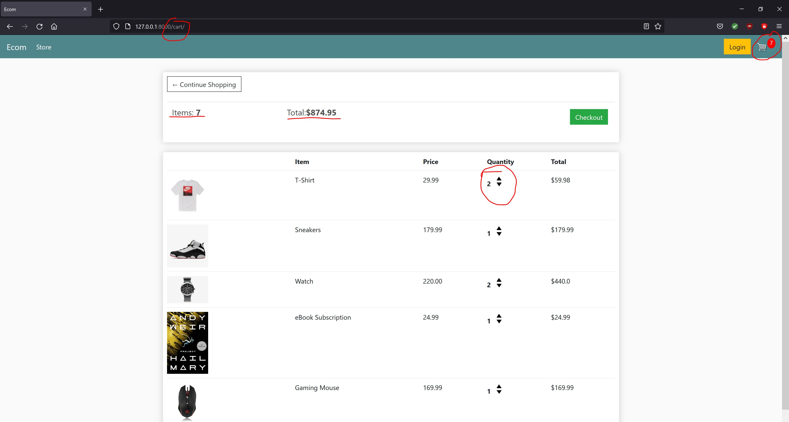
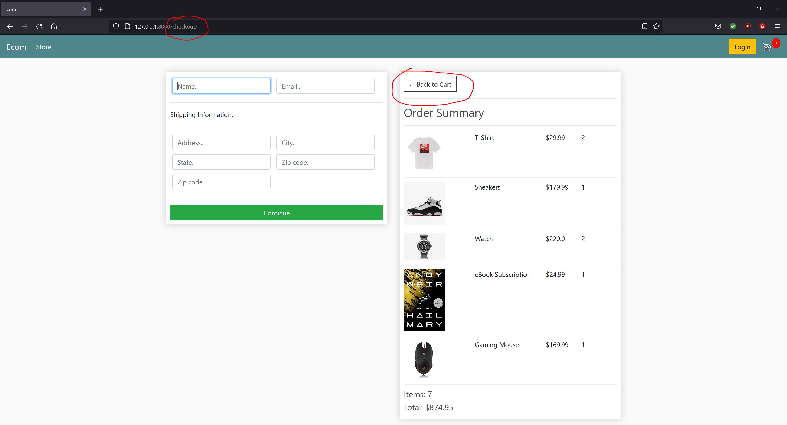
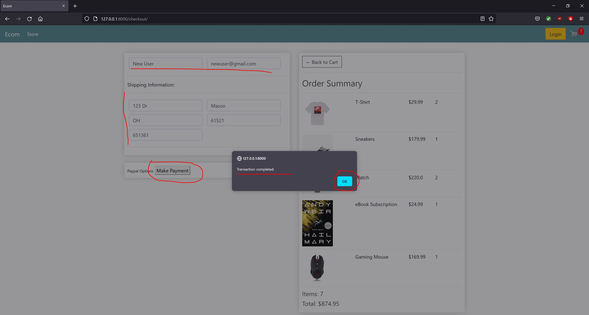

A demo e-commerce website developed using Django & Python along with HTML, CSS and some javascript funcationalitites.  
Authenticated user checkout and guest user checkout using cookies.  
Users can add multiple products to cart (physical and digital products).  
The physical products will have shipping information and digital products won't need that info.  
Authenticated user process: Add Items to Cart --> Edit Order --> Checkout ; View pending and previous orders + Order Details. 
Guest user process: Add items to Cart --> Edit Order --> Checkout ; Create Account to view order.  
The 3 main templates are store.html, cart.html and checkout.html with 6 models - User, Customer, Product, Order, OrderItem, Shipping.  
Future Scope - Add Payment Integration with PayPal and Deployment of the project.  
Demo Screenshots:  
  
  
  
 
